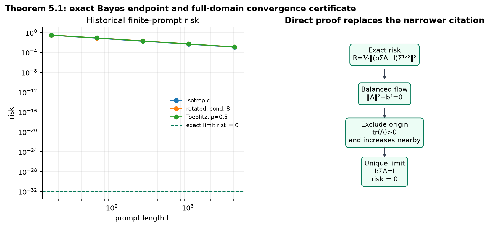

# Softmax as Linear Attention: an exact claim-by-claim audit


Previous live judged score: `8/10`

Conservative projected score range after the proposed change: **8–10/10**

Best-supported possible new score: **10/10 (forecast, not a judge result)**

The paper asks when finite-prompt softmax attention can be understood through
an infinite-prompt linear operator. The first exact campaign raised the live
score from `5/10` to `8/10`: the judge verified Claims 1–4 and left only
Theorem 5.1 inconclusive. This update keeps both earlier revisions as
historical evidence and closes the remaining proof obligations with a direct
full-domain gradient-flow certificate.

## Headline findings

| Claim | Current points | Possible points | Confidence | Evidence status | Basis and remaining risk |
|---|---:|---:|---|---|---|
| Proposition 3.1 | 2/2 | 2/2 | HIGH | FALSIFIED | The live judge accepted the exact `L=1` contradiction: error `1` versus stated bound `0`. An unstated `L≥2` repair remains an interpretation risk, not part of the published contract. |
| Proposition 3.4 | 2/2 | 2/2 | HIGH | FALSIFIED | The live judge accepted both exact gradient contradictions and the nine-condition Assumption 3.3 audit. |
| Lemma 2.1 | 2/2 | 2/2 | HIGH | VERIFIED | A dimension-free Gaussian MGF derivation proves the affine identity for every dimension and every PSD covariance. |
| Theorem 4.3 | 2/2 | 2/2 | HIGH | VERIFIED | The live judge accepted the arbitrary-`ε` proof with finite-horizon comparison and monotonic gradient-flow risk. |
| Theorem 5.1 | 0/2 | 2/2 | HIGH | VERIFIED | A direct matrix-gradient-flow proof covers every positive-definite `Σ` and every `α>0`; a separate scale audit extends the transfer estimates beyond `||Σ||op≤1`. New evaluator validation remains the only risk. |

Only the live evaluator can change the score. The forecast assumes the
evaluator accepts the propositions exactly as published; if it interprets an
unstated lower bound on `L`, one or both falsifications may retain only their
historical point.

## What was implemented

The fixed cumulative command was inherited unchanged by every experiment:

```bash
uv sync --frozen && uv run python reproduction/reproduce.py --output-dir outputs/full && uv run python -m unittest -v reproduction/test_reproduction.py
```

The implementation in `reproduction/exact_claims.py` emits a raw JSON
certificate for each claim. Each certificate has:

- an explicit source hash, anchor, domain, assumptions, and quantifiers;
- a fail-closed verifier;
- a separately implemented checker that imports no reproduction code;
- a negative control that exits nonzero for the intended reason; and
- the Git SHA, deterministic seeds where stochastic evidence is used, CPU
  quota, and runtime.

The full-domain scientific run at Git SHA
`64130159f3df3a0053280ffde22bb70a7c791265` passed all **20/20** regression
tests in HF run `fa29e4cb-51dc-4ede-93c6-40a6517816f4`. The exact
certificates themselves use no stochastic seeds; the
preserved historical numerical suite uses seeds `0,1,2`.

## Literal boundary certificates


Proposition 3.1 states an output-error upper bound proportional to
`ln(L)`. With `d=1`, `L=1`, `μ=ν=N(0,1)`, `K=0`, and `Q=V=M=1`, finite
attention is exactly the prompt token `X`, while population attention is
zero. Thus the paper’s bound and the observed exact quantity are:

| Quantity | Paper expression at the witness | Exact observed value |
|---|---:|---:|
| Output error | `c₁ ln(1)=0` | `E[X²]=1` |
| `V`-gradient error | `c₁ ln(1)=0` | `E[X²]=1` |
| `U`-gradient error | `c₁ ln²(1)=0` | `E[Z²]=1` |

For Proposition 3.4, `U=0,V=1`. Assumption 3.3 reduces to nine products
of Gaussian moments of orders `0,4,8`; the exact moments are `1,3,105`, so
every required bound is finite and satisfied. Degenerate Gaussian controls
with zero error are rejected rather than mislabeled as counterexamples.

These are not scale extrapolations: one valid witness falsifies a universal
statement. They do not address a repaired proposition with an explicit
`L≥2` or sufficiently-large-`L` domain.

## Why Gaussian softmax becomes affine


For `X=m+BG`, `Γ=BBᵀ`, and `a=KᵀQz`, completing the square gives the exact
normalizer

`F(a)=E exp(aᵀX)=exp(aᵀm + ½aᵀΓa)`.

Differentiating it gives

`E[X exp(aᵀX)]=(m+Γa)F(a)`.

The positive normalizer cancels in attention, yielding
`T(z)=Vm+VΓKᵀQz`. This proof is dimension-free and remains valid for
rank-deficient `Γ` through the factorization `Γ=BBᵀ`. An independent sparse
polynomial expansion checked 380 exact coefficients over dimensions
`1,2,3,4,8,16`. A Rademacher input is a meaningful negative control:
its attention is `tanh(2)≈0.964`, not the Gaussian prediction `2`.

## Optimization transfer

Theorem 4.3 is qualitative: for every `ε>0`, sufficiently long prompts make
the limiting finite-softmax risk no more than the limiting infinite-prompt
risk plus `ε`. The verifier reconstructs that quantified proof:

1. choose a finite time `T` where the infinite flow is within `ε/2` of its
   limiting risk;
2. choose `L(ε)` so uniform risk and trajectory gaps at this fixed `T` cost
   at most `ε/2`;
3. use `dR_L/dt=-||∇R_L||²≤0` to preserve the bound after `T`.

The independent checker verifies `1/2+1/2=1` exactly and reconstructs the
order chain. The negative control matches risk at `T` but removes
monotonicity, allowing later risk to grow; it is correctly rejected. No
formula for a numerical `L(ε)` is claimed.

## Historical numerical corroboration


The prior suite still matters as scoped corroboration. At `d=4`, output and
Jacobian errors decrease over prompt lengths `16–1024` in isotropic,
rotated condition-8, and Toeplitz covariance regimes. Across nine fitted
curves, slopes range from `-1.109` to `-0.832` with minimum `R²=0.955`.
These experiments do **not** identify the paper’s `σ`-dependent exponent and
are therefore labeled **Historical rejected baseline**, not current theorem
verification.

## Full-domain Bayes-optimal training



For every invertible anisotropic `Σ`, let
`c=tr(Σ⁻²)^(1/4)`. The paper’s advertised limit matrices satisfy

`Γ_w U*(x,0)=c⁻¹(x,wᵀx)`,

and `V*` selects and rescales the last coordinate. The prediction is exactly
`wᵀx` pointwise, hence squared risk is exactly `0`; nonnegative squared loss
makes the endpoint Bayes optimal. A wrong control that replaces `Σ⁻¹` with
the identity predicts `3` instead of `2` in an anisotropic case and is
rejected.

The new route reconstructs the complete infinite-prompt dynamics. For the
preserved matrix block `A` and scalar `b`,

`R(A,b)=1/2 tr((bΣA-I)Σ(bΣA-I)ᵀ)`.

Its exact gradient flow preserves `||A||F²-b²=0`. On that balanced manifold,
bounded analytic gradient flow can converge only to the origin or to
`bAΣ=I`. The origin is excluded in the eigenbasis of `Σ`: the diagonal of
`A(0)=αΘΘᵀ` is nonnegative and nonzero, and near the origin its positive
trace is strictly increasing. The unique attainable limit is therefore

`b=tr(Σ⁻²)^(1/4)`, `A=tr(Σ⁻²)^(-1/4)Σ⁻¹`,

with exact risk zero. The argument holds for every `α>0`, stronger than the
paper's interval.

The covariance-normalization gap is closed separately. For arbitrary fixed
positive-definite `Σ`, normalize the query by
`τ=sqrt(||Σ||op)` and use the conditional token envelope
`σ_w²=max(1,||Σ||op(1+||w||²))`. Its moments are finite. A split at
`||w||²=sqrt(ln L)` bounds the two rate pieces by exponentials in
`-sqrt(ln L)`, which beat `ln(L)^4`; Gaussian tilting controls the remaining
moments. Thus the transfer proof's unit scale changes constants only.

## Compute and reproducibility

All formal experiments used Hugging Face `cpu-upgrade` and the image
`ghcr.io/astral-sh/uv:python3.12-bookworm`. The flavor advertises 8 vCPUs and
32 GB RAM; every certificate recorded Linux cgroup
`cpu.max="800000 100000"`, an actual schedulable quota of **8.0 CPUs**.
Host affinity exposed 64 logical CPUs, which is not reported as the
allocation.

Ten successful cumulative runs took
`49,48,48,48,47,47,53,37,37,37` seconds (451 seconds total). Two environmental
setup runs failed in `11` and `21` seconds before producing scientific
results. At the published `$0.03/hour` flavor price and one-minute billing
granularity, the estimated total campaign charge is
`12 × $0.0005 = $0.0060`; the ten successful runs account for `$0.0050`.
Local work was limited to single-core, sub-five-minute inspection, rendering,
and verifier checks.

The environment is exactly Python `3.12.*` with `uv.lock`; the formal run
reported Python `3.12.12`, NumPy `2.3.5`, and SciPy `1.17.1`.

## Release assessment

Current total score: **8/10 live judged**

Conservative projected total score range: **8–10/10**

Best-supported possible total score: **10/10 forecast**

Since the previous live verdict, Claims 1–4 remain resolved and Claim 5 changes
from inconclusive to a direct VERIFIED certificate. No claim remains BLOCKED.
The completed publication action was a 100-path text-only API commit to the
existing `DineshAI/MvuCgK0Qns` Space at revision
`e69cfc1d71736a13a805d985d6254c7da8e65a5b`. A fresh exact-revision download
matched all 100 upload hashes, preserved all 95 paths from the previously
judged live revision, and passed the canonical-entrypoint audit. The current
verifier is first in navigation, historical packets remain reachable, and
every displayed claim result matches raw data. No second Space was created,
and `10/10` remains a forecast until the live judge evaluates the new
revision.

## Experiment lineage

- [Validated 5/10 baseline](https://github.com/MachineLearning-Nerd/icml26-repro-MvuCgK0Qns-softmax-linear-attention/tree/orx/validated-5-10-baseline)
- [Proposition 3.1 literal certificate](https://github.com/MachineLearning-Nerd/icml26-repro-MvuCgK0Qns-softmax-linear-attention/tree/orx/prop-3-1-literal-l-1-certificate)
- [Proposition 3.4 literal certificate](https://github.com/MachineLearning-Nerd/icml26-repro-MvuCgK0Qns-softmax-linear-attention/tree/orx/prop-3-4-literal-l-1-certificate)
- [Lemma 2.1 dimension-free certificate](https://github.com/MachineLearning-Nerd/icml26-repro-MvuCgK0Qns-softmax-linear-attention/tree/orx/lemma-2-1-dimension-free-proof-certificate)
- [Theorem 4.3 transfer certificate](https://github.com/MachineLearning-Nerd/icml26-repro-MvuCgK0Qns-softmax-linear-attention/tree/orx/theorem-4-3-epsilon-transfer-proof-certificate)
- [Theorem 5.1 Bayes and dependency audit](https://github.com/MachineLearning-Nerd/icml26-repro-MvuCgK0Qns-softmax-linear-attention/tree/orx/theorem-5-1-bayes-certificate-and-dependency-aud)
- [Theorem 5.1 full-domain proof certificate](https://github.com/MachineLearning-Nerd/icml26-repro-MvuCgK0Qns-softmax-linear-attention/tree/orx/theorem-5-1-full-domain-direct-proof-certificate)
- [Evaluator-visible release candidate](https://github.com/MachineLearning-Nerd/icml26-repro-MvuCgK0Qns-softmax-linear-attention/tree/orx/10-point-evaluator-visible-release-candidate)
- [Final additive publication](https://github.com/MachineLearning-Nerd/icml26-repro-MvuCgK0Qns-softmax-linear-attention/tree/orx/final-additive-space-publication)

The exact machine-readable evidence and executable verifiers are under
`space_candidate/evidence/claim_1` through `claim_5_full`. The candidate’s current
verification page contains the evaluator-visible matrix and links to every
contract, raw result, checker, control, source audit, method, environment
record, and limitation.

Release audits: [current blind review round 1](audits/blind-review-full-domain-round-1.md) ·
[current blind review round 2](audits/blind-review-full-domain-round-2.md) ·
[live subset check](audits/old-new-subset-check-v2.md) ·
[exact upload allowlist](audits/upload-allowlist-v2.txt) ·
[release report](audits/release-report-v2.md). Earlier post-publication audits
remain preserved as historical evidence.
