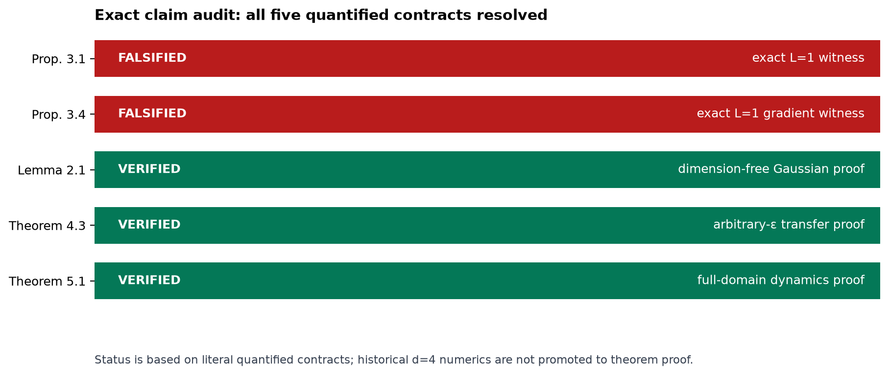
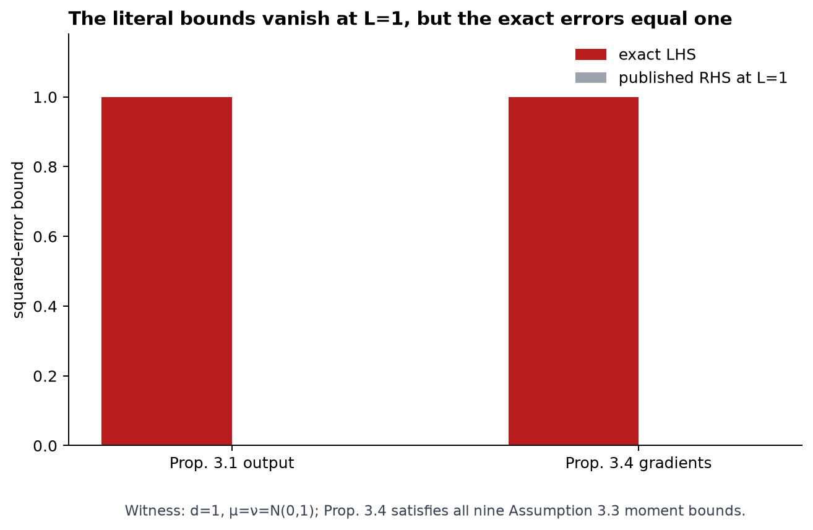
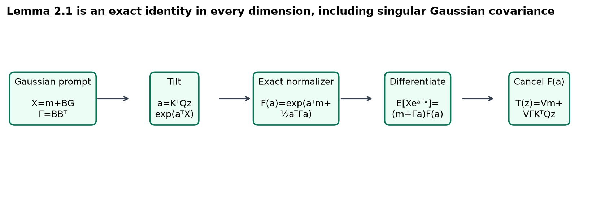
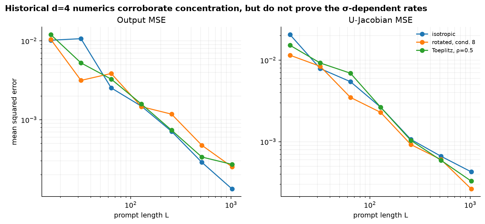
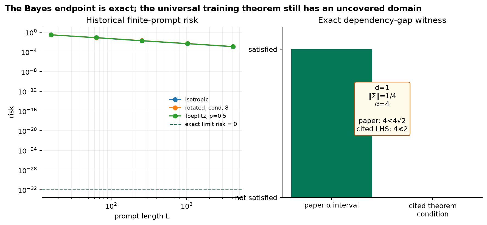

# Softmax as Linear Attention: an exact claim-by-claim audit



Previous live judged score: `5/10`

Conservative projected score range after the proposed change: **7–9/10**

Best-supported possible new score: **9/10 (forecast, not a judge result)**

The paper asks when finite-prompt softmax attention can be understood through
an infinite-prompt linear operator. The earlier reproduction gave useful
`d=4` numerical evidence, but the live judge correctly classified all five
claims as toy evidence. This campaign keeps those results as a historical
baseline and replaces the current verifier with exact quantified contracts:
two literal counterexamples, two proof certificates, and one deliberately
blocked theorem whose endpoint is proved but whose full training domain is
not.

## Headline findings

| Claim | Current points | Possible points | Confidence | Evidence status | Basis and remaining risk |
|---|---:|---:|---|---|---|
| Proposition 3.1 | 1/2 | 2/2 | MEDIUM | FALSIFIED | At the published `L=1` boundary, exact error is `1` and the stated `ln(L)` bound is `0`. An unstated `L≥2` repair would evade the witness. |
| Proposition 3.4 | 1/2 | 2/2 | MEDIUM | FALSIFIED | Both exact gradient errors are `1` while both stated bounds vanish; all nine Assumption 3.3 moment conditions hold. The same unstated-domain risk remains. |
| Lemma 2.1 | 1/2 | 2/2 | HIGH | VERIFIED | A dimension-free Gaussian moment-generating-function derivation proves the affine identity for every dimension and every PSD covariance, including singular cases. |
| Theorem 4.3 | 1/2 | 2/2 | MEDIUM | VERIFIED | An arbitrary-`ε` proof certificate closes the finite-horizon comparison with monotonic gradient-flow risk. It follows the fixed `β∞` dependency proved in the appendix rather than one inconsistent display. |
| Theorem 5.1 | 1/2 | 1/2 retained | MEDIUM | BLOCKED | The advertised anisotropic Bayes endpoint has exact zero risk, but the cited convergence/assumption results do not cover the theorem’s full `Σ,α` domain. No theorem counterexample was found. |

Only the live evaluator can change the score. The forecast assumes the
evaluator accepts the propositions exactly as published; if it interprets an
unstated lower bound on `L`, one or both falsifications may retain only their
historical point.

## What was implemented

The fixed cumulative command was inherited unchanged by every experiment:

```bash
uv sync --frozen && uv run python reproduction/reproduce.py --output-dir outputs/full && uv run python -m unittest -v reproduction/test_reproduction.py
```

The implementation in `reproduction/exact_claims.py` emits a raw JSON
certificate for each claim. Each certificate has:

- an explicit source hash, anchor, domain, assumptions, and quantifiers;
- a fail-closed verifier;
- a separately implemented checker that imports no reproduction code;
- a negative control that exits nonzero for the intended reason; and
- the Git SHA, deterministic seeds where stochastic evidence is used, CPU
  quota, and runtime.

The final cumulative run at Git SHA
`ab03d8e28985c00899253218175049cb32eb0077` passed all **18/18** regression
tests. The exact certificates themselves use no stochastic seeds; the
preserved historical numerical suite uses seeds `0,1,2`.

## Literal boundary certificates



Proposition 3.1 states an output-error upper bound proportional to
`ln(L)`. With `d=1`, `L=1`, `μ=ν=N(0,1)`, `K=0`, and `Q=V=M=1`, finite
attention is exactly the prompt token `X`, while population attention is
zero. Thus the paper’s bound and the observed exact quantity are:

| Quantity | Paper expression at the witness | Exact observed value |
|---|---:|---:|
| Output error | `c₁ ln(1)=0` | `E[X²]=1` |
| `V`-gradient error | `c₁ ln(1)=0` | `E[X²]=1` |
| `U`-gradient error | `c₁ ln²(1)=0` | `E[Z²]=1` |

For Proposition 3.4, `U=0,V=1`. Assumption 3.3 reduces to nine products
of Gaussian moments of orders `0,4,8`; the exact moments are `1,3,105`, so
every required bound is finite and satisfied. Degenerate Gaussian controls
with zero error are rejected rather than mislabeled as counterexamples.

These are not scale extrapolations: one valid witness falsifies a universal
statement. They do not address a repaired proposition with an explicit
`L≥2` or sufficiently-large-`L` domain.

## Why Gaussian softmax becomes affine



For `X=m+BG`, `Γ=BBᵀ`, and `a=KᵀQz`, completing the square gives the exact
normalizer

`F(a)=E exp(aᵀX)=exp(aᵀm + ½aᵀΓa)`.

Differentiating it gives

`E[X exp(aᵀX)]=(m+Γa)F(a)`.

The positive normalizer cancels in attention, yielding
`T(z)=Vm+VΓKᵀQz`. This proof is dimension-free and remains valid for
rank-deficient `Γ` through the factorization `Γ=BBᵀ`. An independent sparse
polynomial expansion checked 380 exact coefficients over dimensions
`1,2,3,4,8,16`. A Rademacher input is a meaningful negative control:
its attention is `tanh(2)≈0.964`, not the Gaussian prediction `2`.

## Optimization transfer

Theorem 4.3 is qualitative: for every `ε>0`, sufficiently long prompts make
the limiting finite-softmax risk no more than the limiting infinite-prompt
risk plus `ε`. The verifier reconstructs that quantified proof:

1. choose a finite time `T` where the infinite flow is within `ε/2` of its
   limiting risk;
2. choose `L(ε)` so uniform risk and trajectory gaps at this fixed `T` cost
   at most `ε/2`;
3. use `dR_L/dt=-||∇R_L||²≤0` to preserve the bound after `T`.

The independent checker verifies `1/2+1/2=1` exactly and reconstructs the
order chain. The negative control matches risk at `T` but removes
monotonicity, allowing later risk to grow; it is correctly rejected. No
formula for a numerical `L(ε)` is claimed.

## Historical numerical corroboration



The prior suite still matters as scoped corroboration. At `d=4`, output and
Jacobian errors decrease over prompt lengths `16–1024` in isotropic,
rotated condition-8, and Toeplitz covariance regimes. Across nine fitted
curves, slopes range from `-1.109` to `-0.832` with minimum `R²=0.955`.
These experiments do **not** identify the paper’s `σ`-dependent exponent and
are therefore labeled **Historical rejected baseline**, not current theorem
verification.

## Bayes endpoint and the unresolved theorem



For every invertible anisotropic `Σ`, let
`c=tr(Σ⁻²)^(1/4)`. The paper’s advertised limit matrices satisfy

`Γ_w U*(x,0)=c⁻¹(x,wᵀx)`,

and `V*` selects and rescales the last coordinate. The prediction is exactly
`wᵀx` pointwise, hence squared risk is exactly `0`; nonnegative squared loss
makes the endpoint Bayes optimal. A wrong control that replaces `Σ⁻¹` with
the identity predicts `3` instead of `2` in an anisotropic case and is
rejected.

The full training theorem is not promoted to VERIFIED. Three distinct routes
were completed:

1. **Compositional proof audit.** Lemma E.1 establishes the transfer
   assumptions only under `||Σ||op≤1`, while Theorem 5.1 states every
   invertible `Σ`.
2. **Direct Bayes algebra.** The endpoint above is exact in arbitrary
   dimension, but endpoint optimality alone does not prove gradient-flow
   convergence.
3. **Boundary dynamics and cited-condition audit.** In `d=1`, the exact
   balanced ODE `x′=s²x(1-sx²)` converges for every positive initialization,
   so this route found no counterexample. In general, however, the paper’s
   displayed `α` interval does not imply the cited JMLR condition. The exact
   witness `d=1`, `||Σ||=1/4`, `α=4` lies in the paper interval but makes the
   cited condition’s left side `4`, not `<2`.

The last item is a proof-dependency gap, not a counterexample to Theorem 5.1.
The unblocker is a general-dimensional convergence proof over the entire
published `Σ,α` domain or a valid assumption-satisfying counterexample.

## Compute and reproducibility

All formal experiments used Hugging Face `cpu-upgrade` and the image
`ghcr.io/astral-sh/uv:python3.12-bookworm`. The flavor advertises 8 vCPUs and
32 GB RAM; every certificate recorded Linux cgroup
`cpu.max="800000 100000"`, an actual schedulable quota of **8.0 CPUs**.
Host affinity exposed 64 logical CPUs, which is not reported as the
allocation.

Seven successful cumulative runs took `49,48,48,48,47,47,53` seconds (340
seconds total). Two environmental setup runs failed in `11` and `21` seconds
before producing scientific results. At the published `$0.03/hour` flavor
price and one-minute billing granularity, the estimated campaign compute
charge is `9 × $0.0005 = $0.0045`; the seven successful evidence/release runs
account for `$0.0035`. Local work was limited to single-core, sub-five-minute
inspection, rendering, and verifier checks.

The environment is exactly Python `3.12.*` with `uv.lock`; the formal run
reported Python `3.12.12`, NumPy `2.3.5`, and SciPy `1.17.1`.

## Release assessment

Current total score: **5/10 live judged**

Conservative projected total score range: **7–9/10**

Best-supported possible total score: **9/10 forecast**

Claims 1–4 changed from toy-only evidence to exact current certificates.
Claim 5 remains BLOCKED because the universal training domain is not covered,
although its Bayes endpoint is exact. The completed publication action was a
78-path text-only API commit to the existing `DineshAI/MvuCgK0Qns` Space at
revision `29699a404594b1b4f4e0e0028e09f5b3e13cbffa`. A fresh exact-revision
download matched all 78 upload hashes and all 95 expected candidate hashes;
the post-publication blind traversal opened 83 files with no missing
conclusion. The published text is mirrored under `space_candidate/` on GitHub
`master`. No second Space was created, and no score increase is claimed before
a new live verdict.

## Experiment lineage

- [Validated 5/10 baseline](https://github.com/MachineLearning-Nerd/icml26-repro-MvuCgK0Qns-softmax-linear-attention/tree/orx/validated-5-10-baseline)
- [Proposition 3.1 literal certificate](https://github.com/MachineLearning-Nerd/icml26-repro-MvuCgK0Qns-softmax-linear-attention/tree/orx/prop-3-1-literal-l-1-certificate)
- [Proposition 3.4 literal certificate](https://github.com/MachineLearning-Nerd/icml26-repro-MvuCgK0Qns-softmax-linear-attention/tree/orx/prop-3-4-literal-l-1-certificate)
- [Lemma 2.1 dimension-free certificate](https://github.com/MachineLearning-Nerd/icml26-repro-MvuCgK0Qns-softmax-linear-attention/tree/orx/lemma-2-1-dimension-free-proof-certificate)
- [Theorem 4.3 transfer certificate](https://github.com/MachineLearning-Nerd/icml26-repro-MvuCgK0Qns-softmax-linear-attention/tree/orx/theorem-4-3-epsilon-transfer-proof-certificate)
- [Theorem 5.1 Bayes and dependency audit](https://github.com/MachineLearning-Nerd/icml26-repro-MvuCgK0Qns-softmax-linear-attention/tree/orx/theorem-5-1-bayes-certificate-and-dependency-aud)
- [Evaluator-visible release candidate](https://github.com/MachineLearning-Nerd/icml26-repro-MvuCgK0Qns-softmax-linear-attention/tree/orx/evaluator-visible-release-candidate)

The exact machine-readable evidence and executable verifiers are under
`space_candidate/evidence/claim_1` through `claim_5`. The candidate’s current
verification page contains the evaluator-visible matrix and links to every
contract, raw result, checker, control, source audit, method, environment
record, and limitation.

Release audits: [first blind review](audits/blind-review-round-1.md) ·
[passing second review](audits/blind-review-round-2.md) ·
[post-publication review](audits/blind-review-round-4-postpublish.md) ·
[historical subset check](audits/old-new-subset-check.md) ·
[exact upload allowlist](audits/upload-allowlist.txt) ·
[command ledger](audits/command-ledger.md).
